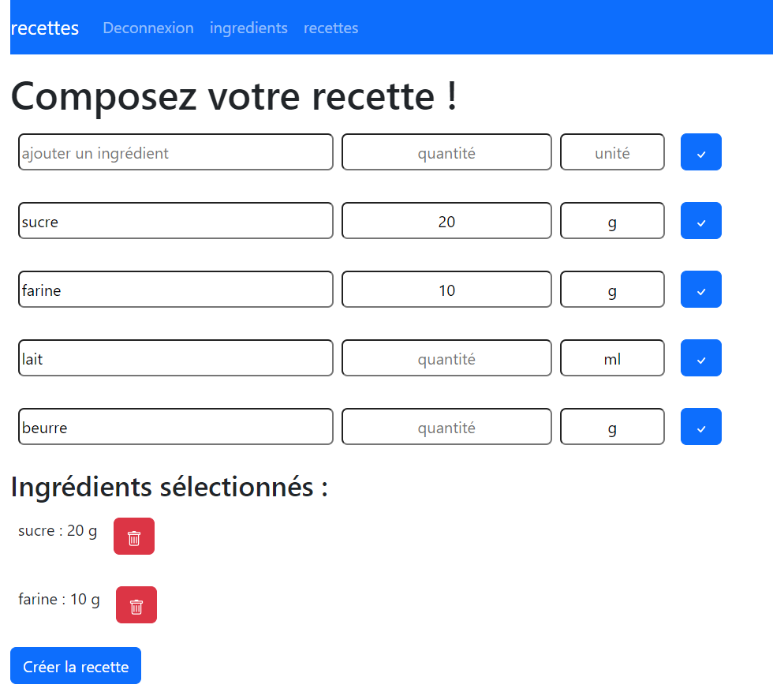
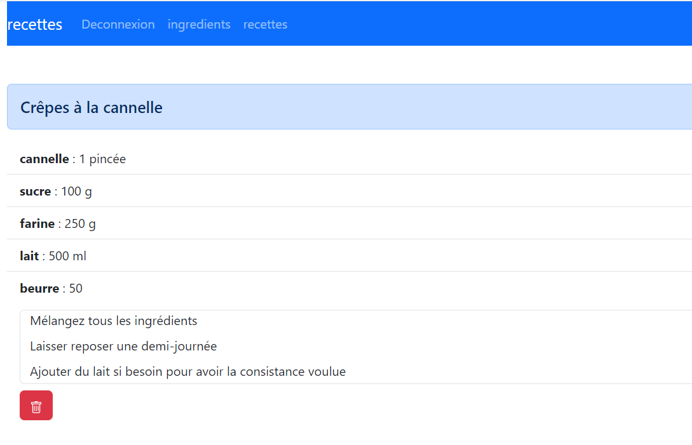

# application React de création de recettes  

L'application nécessite un serveur back-end sur le port 3001, avec les routes : 

- mysqlSaveRecette (POST)
    - {
            titre : string,
            ingredients: string,
            commentaire: string
        }
- mysqlGetIngredients (GET)  
- check (POST)  
    - {
                pseudo: string,
                pwd: string
            }
- mysqlGetRecettes (GET)
- mysqlSupprRecettes/{id} (DELETE)  

Table Mysql admin : 
```sql
CREATE TABLE admin(id INT PRIMARY KEY AUTO_INCREMENT, pseudo VARCHAR(50), pwd TEXT);

INSERT INTO admin (pseudo, pwd) values ("pseudo", SHA1("pwd"));
```  

Table mysql ingredients 
```sql
CREATE TABLE ingredients(id INT PRIMARY KEY AUTO_INCREMENT, ingredient varchar(50), unite VARCHAR(10) );

INSERT INTO ingredients(ingredient, unite) VALUES ("sucre", "g"), ("farine", "g"), ("lait", "ml"), ("beurre", "g");
```

Table mysql recettes 
```sql
create table recettes (id INT PRIMARY KEY AUTO_INCREMENT, titre VARCHAR(100), ingredients TEXT, commentaire TEXT);
```




  


